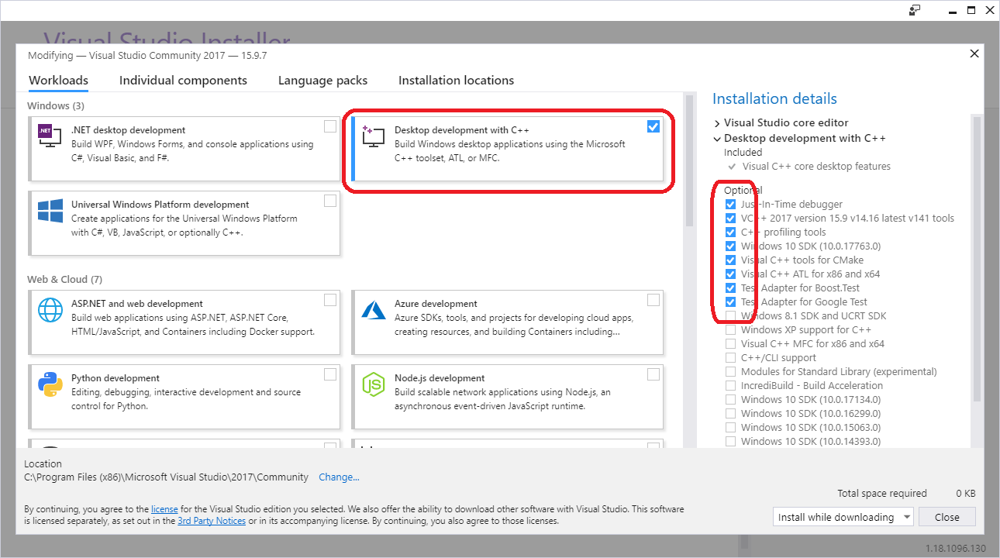

# Visual-HWTools-for-UEFI-Shell

## Goal
Demonstrate how to implement useful software tools to access
the Intel BayTrail (BYT) platform hardware or data structures directly or
by UEFI API.

The projects are kept small and simple to introduce the UEFI shell
programming using "ANSI C", easily and quickly.

## Approach
It is intended to use Visual Studio 2017 as only the development environment.
Furthermore it is intended to use ANSI-C library functions as far as possible.

If doing so, the UEFI Shell applications can be easily debugged
on the Windows development platform, simply by building the sourcecode
as a Win64-executable (change the solution configuration from Efi64 to Win64 ).

## HowTo
1. download VS12017 from here: https://visualstudio.microsoft.com/downloads/
2. select: "Desktop development with C++"
		
3. after installation is finished, open _Visual-HWTools-for-UEFI-Shell.sln_
4. adjust the Windows SDK version: _Project->Retarget Solution_

## Revision history
### 20190213/2 - bugfix, update
* add missing include file
* add HowTo
* update to latest Windows 10 SDK 10.0.17763.0

### 20190213 - initial revision
* BayTrailGPIOSpy
* BayTrailPCIESpy